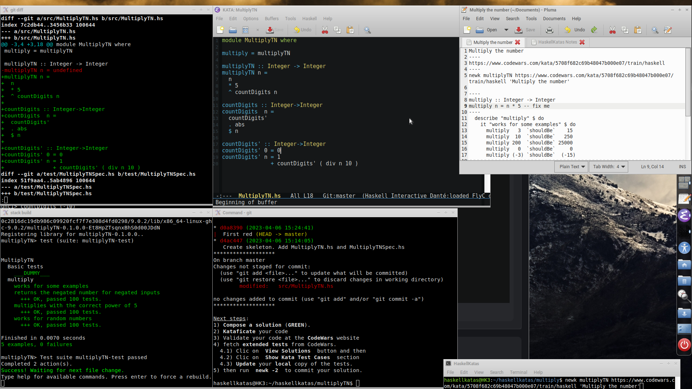

# HaskellKatasLab
{: .fs-9 }

Un entorno completo para practicar **katas de Haskell** con metodología **TDD**, **git** y herramientas estándar de GNU/Linux. Aprende a través del entrenamiento y el placer del descubrimiento.
{: .fs-6 .fw-300 }

[Empezar la instalación](instalacion){: .btn .btn-primary .fs-5 .mb-4 .mb-md-0 .mr-2 }
[Ver en GitHub](https://github.com/naldoco/HaskellKatasLab){: .btn .fs-5 .mb-4 .mb-md-0 }

---

## ¿Qué es HaskellKatas?

**HaskellKatas** es un método auto-dirigido para practicar programación. No se trata sólo de resolver problemas, sino de **interiorizar el uso de las katas** hasta alcanzar una comprensión profunda de la programación. En otras palabras: aprender a través del entrenamiento y del placer de descubrir por uno mismo.

**newk** es el software libre que da soporte a este método: un script en Bash que automatiza la creación de un entorno de kata (editor, REPL `stack ghci`, watcher de archivos, ventanas organizadas) para que puedas concentrarte en escribir código.

Está pensado para usarse en hackathons específicos de **HaskellKatas** y con las katas de [**Codewars**](https://www.codewars.com/).

## ¿Para quién es?

- Personas que quieren aprender Haskell de forma activa, no leyendo libros.
- Equipos que organizan dojos o talleres de programación funcional.
- Quien quiera adoptar TDD como hábito en un lenguaje funcional puro.

## Sistema operativo recomendado

El desarrollo y uso de **newk** se centra en **GNU/Trisquel 11.0 "Aramo"**, aunque se instala sin problemas en **Ubuntu**, **Debian** y se porta fácilmente a cualquier otro sistema **GNU/Linux**.

## Empieza por aquí

1. [**Instalación**](instalacion) — Instala `newk` y todas sus dependencias.
2. [**Uso**](uso) — Crea tu primera kata y empieza a programar.
3. [**Atajos de teclado**](atajos) — Configura los atajos de ventanas.
4. [**Talleres**](talleres) — Material de talleres anteriores (ZuriHac, Libreplanet, Codemotion).
5. [**Acerca de**](acerca-de) — La filosofía del método y enlaces a charlas.
